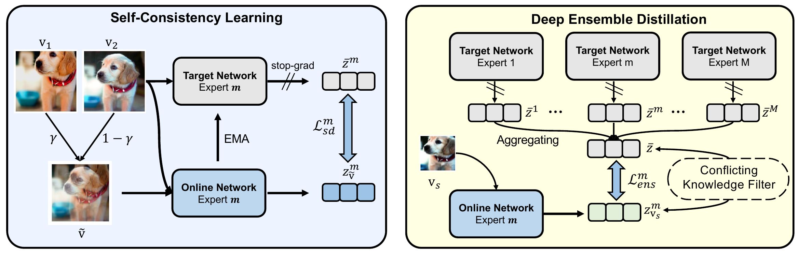

# VICAL: Vicinal Consistency Alignment for Long-Tailed Visual Recognition

Jianggang Zhu · Zheng Wang · Bin Zhu · Yi-Ping Phoebe Chen · Jingjing Chen

Multi-expert models have become a dominant paradigm for long-tailed learning, often attributed to the benefit of expert diversity. However, diversity induced by logit adjustment or explicit regularization does not necessarily improve ensemble accuracy. We show that multi-expert models benefit more from reducing prediction variance than from maximizing diversity, and introduce **VICAL**, a **VI**cinal **C**onsistency **AL**ignment framework built on two complementary components. Self-Consistency Learning discourages reliance on unstable high-frequency patterns and smooths the local loss landscape, while Deep Ensemble Distillation promotes cross-expert agreement over low-frequency semantics using a low-resolution view. Experiments on ImageNet-LT and iNaturalist 2018 demonstrate strong state-of-the-art performance and validate the effectiveness of this consistency-driven design.



*Overview of VICAL. Self-Consistency Learning stabilizes each expert within the vicinity of a sample, while Deep Ensemble Distillation aligns low-frequency semantic knowledge across experts and filters conflicting transfer.*

## Method

### Self-Consistency Learning

Self-Consistency Learning uses a vicinal interpolation of two strongly augmented full-resolution views. The mixed-view online prediction is aligned to the average EMA prediction over the two augmented full-resolution views. This discourages reliance on unstable high-frequency patterns and improves local prediction consistency, particularly for tail classes.

### Deep Ensemble Distillation

DED aligns each expert's low-resolution online prediction to the EMA ensemble consensus formed from two full-resolution views. The resolution asymmetry restricts cross-expert alignment to resolution-invariant semantics. CKF removes only teacher-wrong/student-correct cases. All other teacher/student correctness combinations remain eligible for DED.

### Objective and Inference

The training objective combines Balanced Softmax classification with Self-Consistency Learning and Deep Ensemble Distillation. Both consistency losses are linearly introduced during the first 20 epochs. At inference, only the EMA target network is retained, and expert logits are averaged for prediction.

## Main Results

Paper-reported Top-1 accuracy (%):

| Dataset | Backbone | Epochs | Many | Medium | Few | All |
|---|---|---:|---:|---:|---:|---:|
| ImageNet-LT | ResNeXt-50 | 200 | 72.8 | 60.8 | 42.6 | 62.9 |
| iNaturalist 2018 | ResNet-50 | 100 | 74.3 | 77.3 | 76.2 | 76.6 |
| iNaturalist 2018 | ResNet-50 | 200 | 75.5 | 78.1 | 77.3 | 77.5 |

## Installation

```bash
conda create -n vical python=3.8.20
conda activate vical
pip install -r requirements.txt
```

The code was validated with PyTorch 2.2.2, torchvision 0.17.2, CUDA 12.1, cuDNN 8.9.2, and NVIDIA RTX 3090 GPUs.

## Data Preparation

```text
/path/to/imagenet/
├── train/
└── val/

/path/to/inaturalist2018/
└── train_val2018/
```

The dataset argument must point to the corresponding root directory. The required ImageNet-LT and iNaturalist 2018 split files are included under `dataset/`.

## Training

```bash
# ImageNet-LT: 4 GPUs, 200 epochs, global batch size 256
CUDA_VISIBLE_DEVICES=0,1,2,3 \
./scripts/train_imagenet_lt.sh /path/to/imagenet

# iNaturalist 2018: 8 GPUs, 100 epochs, batch 512, LR 0.2
CUDA_VISIBLE_DEVICES=0,1,2,3,4,5,6,7 \
./scripts/train_inat18.sh /path/to/inaturalist2018

# iNaturalist 2018: resource-constrained 200 epochs, batch 256, LR 0.1
./scripts/train_inat18_200ep.sh /path/to/inaturalist2018
```

## Evaluation

```bash
./scripts/eval_imagenet_lt.sh /path/to/imagenet /path/to/checkpoint.pth.tar

./scripts/eval_inat18.sh /path/to/inaturalist2018 /path/to/checkpoint.pth.tar 100
./scripts/eval_inat18.sh /path/to/inaturalist2018 /path/to/checkpoint.pth.tar 200
```

## Citation

```bibtex
@misc{zhu2026,
  title  = {VICAL: Vicinal Consistency Alignment for Long-Tailed Visual Recognition},
  author = {Zhu, Jianggang and Wang, Zheng and Zhu, Bin and Chen, Yi-Ping Phoebe and Chen, Jingjing}
  journal={arXiv preprint},
  year={2026}
}
```

## Acknowledgements

We thank the authors of [RIDE](https://github.com/frank-xwang/RIDE-LongTailRecognition), [LDAM-DRW](https://github.com/kaidic/LDAM-DRW), [PaCo](https://github.com/JIA-Lab-research/Parametric-Contrastive-Learning), and [MDCS](https://github.com/fistyee/MDCS) for their open-source implementations.

## License

This project is released under the [MIT License](LICENSE). Third-party licenses are included in [`LICENSES/`](LICENSES/).
